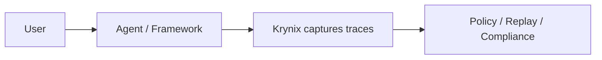
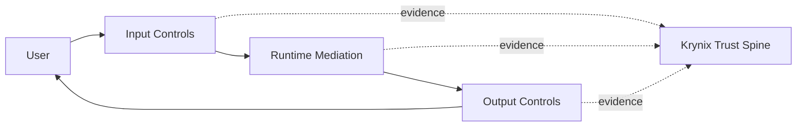
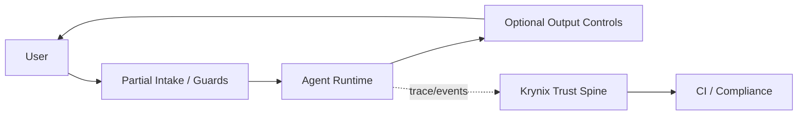
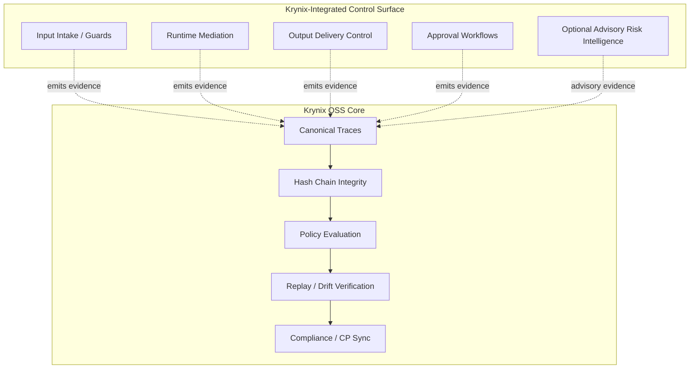
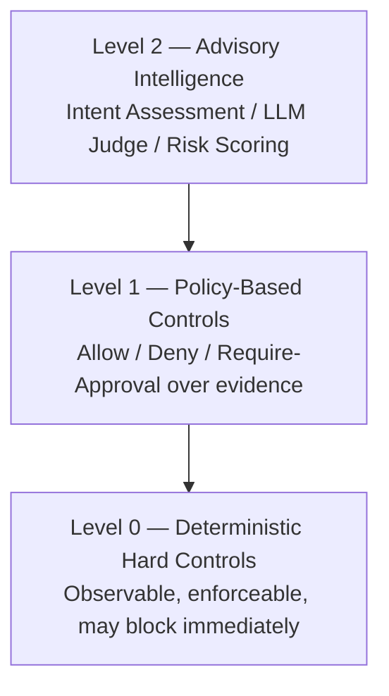
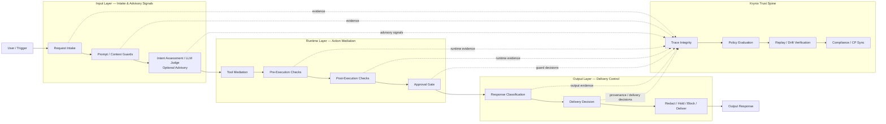

# Platform Architecture Specification

## Purpose
Define the canonical, decision-making architecture for the Krynix platform direction and remove ambiguity between current behavior and roadmap behavior.

## Where Used
- Product and architecture decisions.
- Repository documentation alignment.
- Agent instruction and rule alignment.
- CI documentation consistency checks.
- Consumer integration design for IDE-sidecar and framework-runtime deployments.

## Guarantees (Current)
- [CURRENT] Krynix OSS is the trust spine, not the full agent platform.
  Evidence: `docs/10_architecture/architecture.md`, `packages/core/src/index.ts`
- [CURRENT] Krynix provides trace integrity (hash chain), policy evaluation, and CI/post-run verification workflows.
  Evidence: `packages/core/src/hash-chain.ts`, `packages/cli/src/evaluate.ts`, `packages/replay/src/replay-runner.ts`
- [CURRENT] `krynix evaluate` enforces policy outcomes via exit codes in CI.
  Evidence: `packages/cli/src/evaluate.ts`, `packages/cli/src/help.ts`
- [CURRENT] `krynix replay --verify` validates trace structure/integrity and hash determinism. The `--golden-dir` flag verifies integrity of all traces in a directory independently.
  Evidence: `packages/replay/src/replay-runner.ts`, `packages/replay/src/golden-validator.ts`
- [CURRENT] Deterministic trace production exists through canonical JSON + hash chain + seeded session/event generation (when seed is provided).
  Evidence: `packages/core/src/canonical-json.ts`, `packages/core/src/session.ts`, `packages/core/src/trace-writer.ts`
- [CURRENT] Hash chain validation provides **structural integrity verification** — detects naive tampering (event mutation without chain rebuild) and corruption. By itself, the hash chain does NOT defeat an attacker who regenerates the chain over modified data; that gap requires the signing layer below.
  Evidence: `packages/core/src/hash-chain.ts`, `packages/core/src/hash-chain.test.ts` (adversarial suite)
- [CURRENT] Ed25519 hash-chain signing (opt-in via `krynix sign` + `evaluate --public-key`) provides **cryptographic tamper-evidence** against intentional modification — including regeneration, event deletion/insertion, reorder, and truncation attacks. When enforced in CI this is the trust primitive. Correctness of recorded data (e.g. that `tool_name` reflects the real tool, not a fallback) is the responsibility of the adapter layer and must be verified by integration tests against real framework output.
  Evidence: `packages/core/src/signing.ts`, `packages/core/src/signing.test.ts`, `packages/cli/src/sign.ts`, `packages/adapter-langchain/src/e2e-langchain.test.ts`
- [CURRENT] Closed-assistant integrations (Copilot/Claude/Codex style) follow an observable-only contract and do not claim hidden internal reasoning access.
  Evidence: `docs/10_architecture/integration_blueprints.md`, `docs/10_architecture/determinism_spec.md`
- [PARTIAL] Replay behavior assurance is comparison-based and does not execute live agent logic today.
- [CURRENT] Redaction is field-name-pattern based and deterministic, but scoped to matched keys only.
  Evidence: `packages/core/src/redaction.ts`, `packages/core/src/redaction.test.ts`
- [CURRENT] Runtime blocking is external to Krynix OSS today; Krynix is primarily CI/post-run enforcement unless integrated into a deployment-specific control surface.
  Evidence: `docs/10_architecture/policy_spec.md`, `packages/cli/src/evaluate.ts`
- [CURRENT] Krynix does not universally receive user input first. Request-ingress ownership depends on deployment mode.
  Evidence: `docs/00_overview/non_goals.md`

## Planned Guarantees (Future)
- [PLANNED] Execution-mode replay that re-runs deterministic agent decision/tool paths via a replay executor interface.
- [PLANNED] Richer input/runtime/output layer guards integrated as first-class runtime controls.
- [PLANNED] Broader redaction defaults and configurable organization policy profiles.
- [PLANNED] Stronger provenance mapping from input signals through runtime and output delivery decisions.
- [PLANNED] Profile-based enforcement modes (`dev`, `staging`, `prod`) for sidecar and hybrid deployments.

## Non-Goals
- [CURRENT] Krynix does not replace agent frameworks or orchestration runtimes.
  Evidence: `docs/00_overview/non_goals.md`
- [CURRENT] Krynix does not host LLM inference.
  Evidence: `docs/00_overview/non_goals.md`
- [CURRENT] Krynix does not guarantee perfect malicious-intent detection.
  Evidence: `docs/00_overview/non_goals.md`
- [CURRENT] Krynix does not claim deterministic execution replay as implemented behavior today.
  Evidence: `packages/replay/src/replay-runner.ts`, `packages/cli/src/replay.ts`
- [CURRENT] Krynix does not universally own the request ingress point.
  Evidence: `docs/00_overview/non_goals.md`
- [CURRENT] Krynix does not treat inferred intent alone as the primary trust control. Observable actions and delivery decisions are stronger enforcement points.
  Evidence: `docs/10_architecture/threat_model.md`, `docs/10_architecture/policy_spec.md`

## Interfaces / Contracts

### Layer Model
- Input Layer: request intake, context normalization, prompt/context guards, and optional advisory risk assessment.
- Runtime Layer: tool mediation, pre/post execution checks, approval decisions, and runtime evidence capture.
- Output Layer: response classification, delivery control, provenance, and output guard checks.
- Krynix Role: cross-layer trust spine for traceability, policy evidence, replay/drift verification, compliance packaging, and control-plane synchronization.

### Deployment Modes

Krynix supports multiple deployment modes. These modes must not be conflated.

#### Passive / Post-Run Mode



**Meaning:**
Krynix does not receive user input first. It observes execution artifacts exposed by the host integration and enforces trust primarily in CI/post-run workflows.

#### Inline Sidecar / Gateway Mode



**Meaning:**
A deployment-specific control surface may receive the request before agent execution. Krynix records evidence across all layers but remains the trust spine, not the entire platform.

#### Hybrid Mode



**Meaning:**
Some controls occur before execution, some during runtime, and some after execution. Krynix remains the canonical evidence, policy, replay, and compliance layer.

### Deployment Modes Overview

```mermaid
flowchart TB
    subgraph Passive["Passive / Post-Run Mode"]
        U1[User]
        A1[Agent / Framework]
        K1[Krynix Trust Spine]
        C1[Policy / Replay / Compliance]
        U1 --> A1 --> K1 --> C1
    end

    subgraph Inline["Inline Sidecar / Gateway Mode"]
        U2[User]
        I2[Input Controls]
        R2[Runtime Mediation]
        O2[Output Controls]
        K2[Krynix Trust Spine]
        U2 --> I2 --> R2 --> O2 --> U2
        I2 -. evidence .-> K2
        R2 -. evidence .-> K2
        O2 -. evidence .-> K2
    end

    subgraph Hybrid["Hybrid Mode"]
        U3[User]
        I3[Partial Intake / Guards]
        A3[Agent / Framework]
        O3[Optional Output Controls]
        K3[Krynix Trust Spine]
        C3[Policy / Replay / Compliance]
        U3 --> I3 --> A3 --> O3 --> U3
        A3 -. trace/events .-> K3 --> C3
    end
```



### Determinism Layering

Determinism remains a core design principle.

- `CURRENT`: deterministic trace artifact generation and integrity verification.
- `PARTIAL`: baseline drift comparison exists as a library function (`compareTraces`) but is not yet integrated into the CLI.
- `PLANNED`: deterministic execution replay of live decision/tool paths.

Current replay guarantee is integrity verification via CLI. Baseline drift comparison exists at library level only.
Execution replay is planned and tracked.

### Closed-Assistant Observability Limits

For Copilot/Claude/Codex-style integrations, Krynix captures only observable signals from host integration points.

Krynix captures:
- prompt/context metadata when exposed,
- tool calls/results and timings,
- guard and policy decisions,
- output mapping/provenance signals when exposed,
- CI trust gate outcomes.

Krynix does not claim:
- hidden model reasoning streams,
- private provider-side internal chain data,
- provider-internal chain-of-thought access.

### Responsibility Boundary



### Sidecar Control Point Behavior

Trusted interception boundaries for sidecar/wrapper model:

| Boundary | Trigger | Control Action | Trace Evidence |
|---|---|---|---|
| Request intake | user sends prompt/task | normalize request, bind source/repo/environment context | `observation` + request metadata |
| Prompt/context guard | inbound request/context prepared | deterministic or heuristic guard checks | `observation` + `metadata.guard.*` |
| Optional advisory assessment | uncertain or high-risk request | intent assessment / LLM-judge labels, escalation suggestion | `observation` + `metadata.intent.*` |
| Tool pre-check | candidate command/tool call | allow/deny/require-approval | `decision` + `metadata.guard.*` |
| Tool post-check | command/tool completed | scan output, evaluate follow-up risk | `tool_result` + `metadata.runtime.*` |
| Output egress | assistant response ready | classify, redact/hold/block/deliver | `decision` + `metadata.output.*` |

### Runtime Profile Semantics (Truth Table)

The following table describes platform-side deployment profile behavior, not current universal OSS behavior.

| Condition | dev | staging | prod |
|---|---|---|---|
| Sidecar unavailable | Fail-open + warning evidence | Fail-closed for protected controls | Fail-closed for protected controls |
| Medium/high uncertain risk | Monitor + annotate | Require approval | Require approval |
| Deterministic critical violation | Monitor + annotate | Require approval or deny by rule | Deny |
| Approval timeout | Continue with warning by profile rule | Block | Block |

### Enforcement Hierarchy

Krynix-integrated control systems apply controls in the following order:

1. **Deterministic Hard Controls**
   Action/path/network/output rules directly enforceable from observable behavior.
2. **Policy-Based Controls**
   Declarative allow/deny/require-approval rules over runtime evidence and traces.
3. **Advisory Intelligence**
   Intent assessment, prompt classification, LLM-as-judge, and heuristic scoring used to annotate, escalate, or require approval.

Rule:
Advisory intelligence must not be the sole basis for critical denial unless explicitly configured by a deployment profile.



### Default Critical Deny Baseline (Profile: prod)

Categories:
1. Exfiltration-risk actions.
2. Destructive file/command actions.

Examples:
- transmit secret-like values to non-approved destination,
- write credential-like content to outbound channel,
- destructive workspace command without approval,
- unauthorized writes outside approved project boundary.

### Approval Path (Local + CI)
1. Runtime/local trust control emits `require-approval` with evidence refs.
2. Local user approval captures rationale (who/why/when).
3. Approval event is persisted in trace metadata.
4. CI evaluates final trace with policy + replay checks.
5. Merge gate enforces unresolved or denied approvals as blocking outcomes.

### Input -> Runtime -> Output Sequence (Krynix as Spine)



### Integration Insertion Points

| Insertion Point | Layer | Required Capture | Trace Mapping |
|---|---|---|---|
| Request intake | Input | actor, workspace, repo SHA/branch, request source, environment/profile | `observation` + metadata namespaces |
| Prompt/context guard | Input | guard result, suspicious signals, context boundary facts | `observation` + `metadata.guard.*` |
| Optional advisory assessment | Input | risk labels, confidence, signals, escalation suggestion | `observation` + `metadata.intent.*` |
| Tool pre-check | Runtime | guard decision, rule id, approval state, arguments hash | `decision` + `tool_call` metadata |
| Tool post-check | Runtime | duration, output scan, policy impact, violations | `tool_result` + `observation` |
| Response egress | Output | classification, policy flags, provenance ref, delivery action | `decision` + `observation` |

### Mandatory Metadata Namespace Rules
- `metadata.intent.*`: advisory intent/judge signals and confidence.
- `metadata.guard.*`: guard rule ids, severities, decision rationale.
- `metadata.runtime.*`: runtime scan outcomes, tool mediation facts.
- `metadata.output.*`: response mapping, delivery decision, provenance references.

Rules:
- Namespace keys must be stable and lowercase.
- Reserved internal keys prefixed with `_krynix_` must not be overridden by adapters.
- Metadata values must be JSON-serializable.
- Advisory metadata must not be treated as authoritative blocking evidence unless explicitly elevated by deployment profile.

### Contract Draft: `IntentAssessment`

Producer: optional input-layer classifiers and optional judge adapters.
Consumer: runtime policy engine, routing layer, provenance builder, or approval workflow.

Status: Draft / Optional / Advisory

Fields:
- `id: string`
- `risk_score: number` (0 to 1)
- `risk_labels: string[]`
- `confidence: number` (0 to 1)
- `signals: string[]`
- `timestamp: string` (ISO-8601)

Invariants:
- `risk_score` and `confidence` must be within [0, 1].
- `risk_labels` must be normalized lowercase tokens.

Insertion event type mapping to current trace schema:
- `observation` payload for captured signals.
- optional `decision` payload for routing/escalation outcome.
- metadata namespaces: `metadata.intent.*`, `metadata.guard.*`.

Example:
```json
{
  "id": "intent-8f2a",
  "risk_score": 0.82,
  "risk_labels": ["prompt_injection", "exfiltration_risk"],
  "confidence": 0.76,
  "signals": ["system_override_attempt", "credential_request"],
  "timestamp": "2026-03-02T10:21:00Z"
}
```

### Contract Draft: `GuardDecision`

Producer: input/runtime/output guard components.
Consumer: runtime policy engine, trace bridge, output mapper.

Status: Near-Canonical

Fields:
- `component: string`
- `action: "allow" | "deny" | "require-approval" | "warn"`
- `severity: "info" | "warning" | "error" | "critical"`
- `rule_id: string`
- `message: string`
- `evidence_refs: string[]`

Invariants:
- `rule_id` must be stable and traceable to a ruleset.
- `evidence_refs` must point to immutable trace or artifact identifiers.

Insertion event type mapping to current trace schema:
- `decision` payload for guard action.
- `observation` payload for supporting evidence snapshots.
- metadata namespaces: `metadata.guard.*`.

Example:
```json
{
  "component": "multi_scan_guard",
  "action": "require-approval",
  "severity": "error",
  "rule_id": "MSG-014",
  "message": "Potential poisoned instruction block detected",
  "evidence_refs": ["trace:session-1:seq-21", "artifact:file:/workspace/prompt.md"]
}
```

### Contract Draft: `ToolExecutionEnvelope`

Producer: runtime tool mediation proxy.
Consumer: trace bridge, policy engine, observability pipeline.

Status: Near-Canonical

Fields:
- `tool_name: string`
- `arguments_hash: string`
- `pre_checks: GuardDecision[]`
- `post_checks: GuardDecision[]`
- `duration_ms: number`

Invariants:
- `arguments_hash` must be deterministic for identical tool arguments.
- `duration_ms` must be non-negative.

Insertion event type mapping to current trace schema:
- `tool_call` payload for tool identity and arguments.
- `tool_result` payload for outputs and duration.
- metadata namespaces: `metadata.runtime.*`, `metadata.guard.*`.

Example:
```json
{
  "tool_name": "file_write",
  "arguments_hash": "2f7a2e...",
  "pre_checks": [
    {
      "component": "path_guard",
      "action": "allow",
      "severity": "info",
      "rule_id": "PG-001",
      "message": "Path within workspace",
      "evidence_refs": ["trace:session-1:seq-11"]
    }
  ],
  "post_checks": [],
  "duration_ms": 17
}
```

### Contract Draft: `OutputMapping`

Producer: output layer mapper and provenance builder.
Consumer: delivery channel, audit/compliance export, analytics.

Status: Near-Canonical

Fields:
- `classification: "safe" | "needs-review" | "blocked" | "incomplete"`
- `policy_flags: string[]`
- `provenance_ref: string`
- `delivery_action: "deliver" | "hold" | "redact" | "block"`

Invariants:
- `delivery_action` must be consistent with `classification`.
- `provenance_ref` must resolve to trace-linked evidence.

Insertion event type mapping to current trace schema:
- `decision` payload for delivery action.
- `observation` payload for provenance linkage.
- metadata namespaces: `metadata.output.*`.

Example:
```json
{
  "classification": "needs-review",
  "policy_flags": ["approval_required", "high_risk_intent"],
  "provenance_ref": "prov:session-1:out-4",
  "delivery_action": "hold"
}
```

### Consumer Deployment Topologies

| Topology | Placement | Typical Consumer | Tradeoff |
|---|---|---|---|
| Local sidecar | Developer machine / dev container | VSCode/Codex-style workflows | Lowest adoption friction, weaker centralized runtime control |
| In-process plugin | Agent runtime process | Framework teams (OpenClaw/custom) | Highest fidelity hook coverage, tighter coupling |
| Service-side collector | Remote control/processing service | Platform/security teams | Better governance centralization, higher integration effort |

## Operational Usage
- CI Gate (primary):
  - `krynix evaluate --trace <trace.jsonl> --policy <policy-or-dir>`
  - `krynix replay --verify --trace <current.trace.jsonl>`
- Golden trace integrity checks:
  - `krynix replay --verify --golden-dir test/golden/`
- Compliance evidence packaging:
  - `krynix compliance export --trace <trace.jsonl> --output <bundle-dir>`

Consistency marker statements (used by CI docs checks):
- `REPLAY_CURRENT_MODE=integrity_verification`
- `KRYNIX_ROLE=trust_spine_not_full_platform`
- `KRYNIX_RUNTIME_ENFORCEMENT=external_runtime_controls_ci_postrun_in_oss`
- `KRYNIX_INPUT_LAYER_MODE=deployment_specific_not_universal`
- `KRYNIX_ENFORCEMENT_PRINCIPLE=block_on_actions_not_inferred_intent`

## Known Gaps And Roadmap
- [PARTIAL] Replay assurance: integrity verification via CLI is `CURRENT`; drift comparison exists as library function (`compareTraces`) but is not CLI-integrated; deterministic execution replay is not implemented.
- [PARTIAL] Redaction defaults do not cover every common secret key naming pattern.
- [PARTIAL] Runtime enforcement blueprint exists, but implementation remains mostly external/integration-driven.
- [PLANNED] Execution replay mode with deterministic executor contract.
- [PLANNED] Input/runtime/output enforcement profile rollout (`dev`, `staging`, `prod`).
- [PLANNED] Stronger standardization of input advisory contracts once deployment patterns stabilize.
